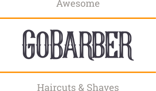

# 
GoBarber - React Web Frontend

# 

## About

Application for barber shops appointments booking. Develop during the GoStack bootcamp carried out by Rocketseat.

The platform allow users to make appointments with specified date and hour with providers **through the native mobile app**, not allowing conflicts in the providers schedule. The providers can then check out their schedule on this **React web app**, seeing upcoming customers.

You can check it out up and running at Netlify by clicking [here](https://gobarber-web-react.netlify.app/).

## Where can I find the backend API and the mobile app?

You can check the repositories here:

- [NodeJS API](https://github.com/leonardorib/gobarber-api)
- [React Native app](https://github.com/leonardorib/gobarber-mobile)

## Technologies in the Web Frontend

- Typescript
- React
- Styled-components
- React Context API
- Continuous Deployment with Netlify + Github
