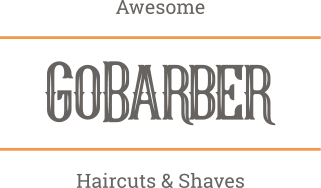
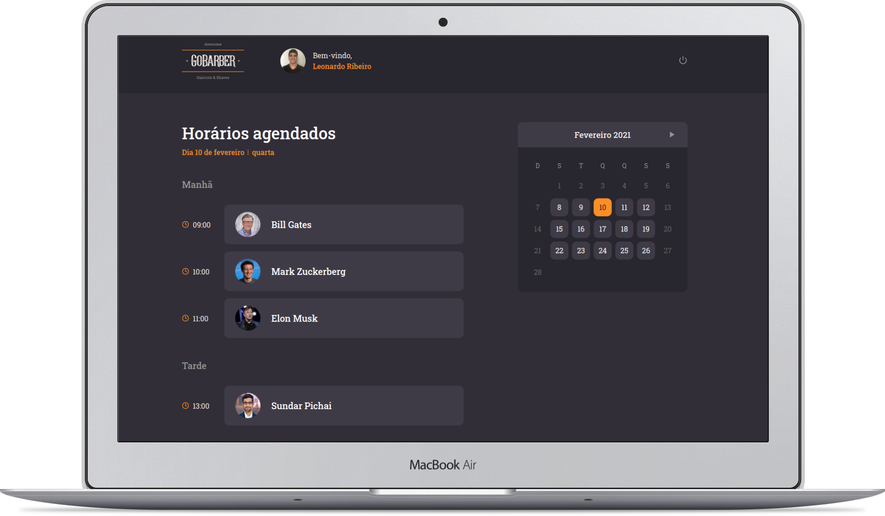

# 
GoBarber - React Web Frontend

 

 

## :notebook_with_decorative_cover: About

Application for barber shops appointments booking. Developed along the GoStack bootcamp carried out by Rocketseat.

The platform allow users to make appointments with specified date and hour with providers **through the native mobile app**, not allowing conflicts in the providers schedule. The providers can then check out their schedule on this **React web app**, seeing upcoming customers.

## :computer: Can I see it running?

You can check it out up and running at [Netlify by clicking here](https://gobarber-web-react.netlify.app/).

## :technologist: Where can I find the backend API and the mobile app code?

You can check the repositories here:

- [NodeJS API](https://github.com/leonardorib/gobarber-api)
- [React Native app](https://github.com/leonardorib/gobarber-mobile)

## :rocket: Technologies in the Web Frontend

- Typescript
- React
- Styled-components
- React Context API
- Continuous Deployment with Netlify + Github

## The author

Made with :heart: by Leonardo Ribeiro.

Get in touch! :smiley:

